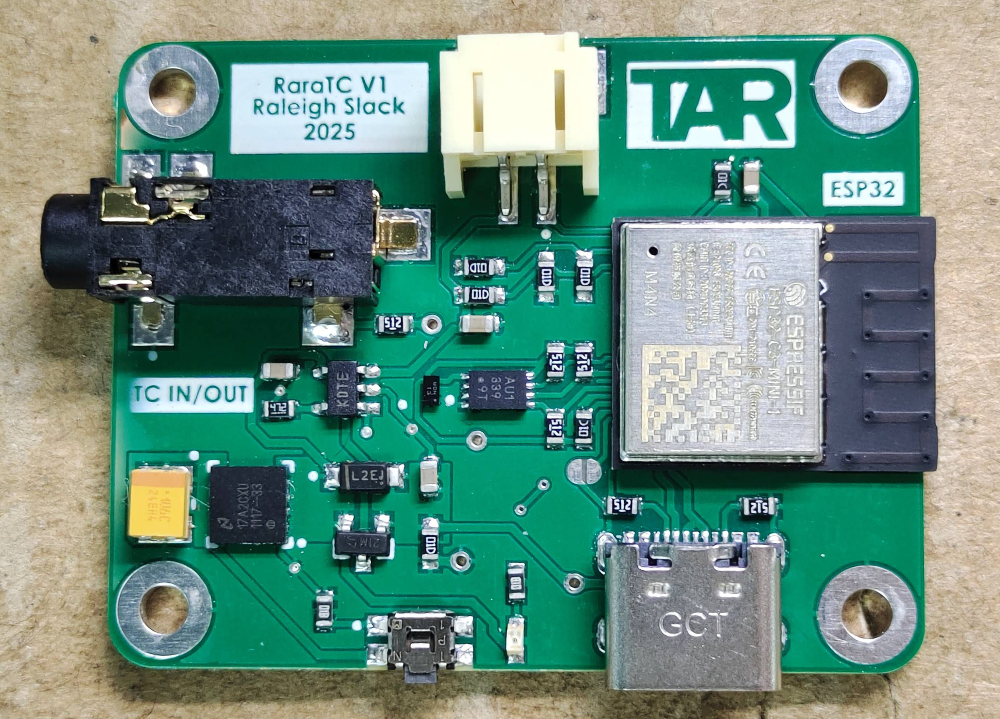

# RSync Firmware  
The goal of this project is to create a system of devices that are able to wirelessly sync to each other and output SMPTE LTC Timecode to make editing effortless.

## How to Use Example

### Hardware Required

The custom RSYNC board created by Raleigh Slack.  

### References used

[LTC Timecode Standard](https://law.resource.org/pub/in/bis/S04/is.12429.1.1988.pdf) - Describes the way in which LTC Timecode functions and gives specifications as how to meet the SMPTE standard.  
[USB-C in Embedded Designs: Practical Overview](https://fraimichael.medium.com/usb-c-in-embedded-designs-practical-overview-17bed72da05a) - A very good overview on how to incoporate USB-C into even the smallest designs.  
[ESP32-C3 Docs](https://docs.espressif.com/projects/esp-idf/en/v5.5/esp32c3/index.html) - Gives a great overview on how to use FreeRTOS, as well as ESP32 specific libraries.  

### Tools Used

[Altium Designer](https://www.altium.com/altium-designer) - Main PCB design software
[EasyEDA](https://easyeda.com/) - Can generate footprints and symbols for Altium

### Build and Flash

Run `idf.py -p PORT flash monitor` to build, flash and monitor the project.

(To exit the serial monitor, type ``Ctrl-]``.)

See the [Getting Started Guide](https://docs.espressif.com/projects/esp-idf/en/latest/get-started/index.html) for full steps to configure and use ESP-IDF to build projects.
